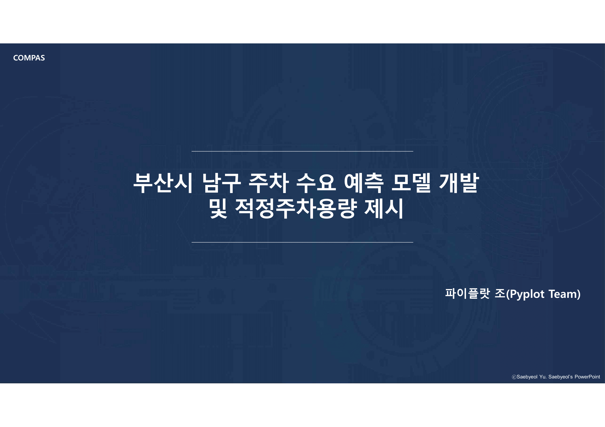

# 2021-COMPAS 부산시 남구 주차 수요 예측

### 1) 과제 선정 배경 및 목표
- 부산광역시 남구 주민들의 주차 불편을 해소하고자 진행된 과제 
- 구민들의 거주지역(주택단지 내) 중심으로, 향후 3년 후 주차수요 및 예측 진행

### 2) EDA 및 전처리
- 불법주정차단속현황 ([EDA](https://github.com/chom5621/2021-COMPAS/blob/e955a9523012123627a29d7bb6bde53ff0cde2d0/2.EDA(%EB%B6%88%EB%B2%95%EC%A3%BC%EC%A0%95%EC%B0%A8%EB%8B%A8%EC%86%8D%ED%98%84%ED%99%A9).ipynb) & [전처리](https://github.com/chom5621/2021-COMPAS/blob/e955a9523012123627a29d7bb6bde53ff0cde2d0/2.%EC%A0%84%EC%B2%98%EB%A6%AC(%EB%B6%88%EB%B2%95%EC%A3%BC%EC%A0%95%EC%B0%A8%EB%8B%A8%EC%86%8D%ED%98%84%ED%99%A9).ipynb))
- 인구수, 자동차등록수 ([EDA](https://github.com/chom5621/2021-COMPAS/blob/e955a9523012123627a29d7bb6bde53ff0cde2d0/2.EDA(%EC%9D%B8%EA%B5%AC%EC%88%98,%EC%9E%90%EB%8F%99%EC%B0%A8%EB%93%B1%EB%A1%9D%EC%88%98).ipynb) & [전처리](https://github.com/chom5621/2021-COMPAS/blob/e955a9523012123627a29d7bb6bde53ff0cde2d0/2.%EC%A0%84%EC%B2%98%EB%A6%AC(%EC%9D%B8%EA%B5%AC%EC%88%98,%EC%9E%90%EB%8F%99%EC%B0%A8%EB%93%B1%EB%A1%9D%EC%88%98%20%EC%B6%94%EC%84%B8%EB%B6%84%EC%84%9D).ipynb))
- 버스, 지하철 ([EDA & 전처리](https://github.com/chom5621/2021-COMPAS/blob/e955a9523012123627a29d7bb6bde53ff0cde2d0/2.%EC%A0%84%EC%B2%98%EB%A6%AC(%EB%B2%84%EC%8A%A4,%EC%A7%80%ED%95%98%EC%B2%A0).ipynb))
- 주거시설 ([EDA & 전처리](https://github.com/chom5621/2021-COMPAS/blob/e955a9523012123627a29d7bb6bde53ff0cde2d0/2.%EC%A0%84%EC%B2%98%EB%A6%AC(%EC%A3%BC%EA%B1%B0%EC%8B%9C%EC%84%A4).ipynb))
- 가구수 ([EDA & 전처리](https://github.com/chom5621/2021-COMPAS/blob/e955a9523012123627a29d7bb6bde53ff0cde2d0/2.%EC%A0%84%EC%B2%98%EB%A6%AC(%EA%B0%80%EA%B5%AC%EC%88%98,%EC%B5%9C%EC%A2%85%EB%8D%B0%EC%9D%B4%ED%84%B0).ipynb))
- 도로, 건물노후도, 공시지가 ([EDA & 전처리](https://github.com/chom5621/2021-COMPAS/blob/e955a9523012123627a29d7bb6bde53ff0cde2d0/2.EDA(%EA%B3%B5%EC%8B%9C%EC%A7%80%EA%B0%80,%EA%B1%B4%EB%AC%BC%EB%85%B8%ED%9B%84%EB%8F%84)_4.%EC%B5%9C%EC%A2%85%EA%B2%B0%EA%B3%BC(%EC%A3%BC%EC%B0%A8%EA%B0%80%EB%8A%A5%EB%A9%B4%EC%88%98).ipynb))

### 3) 회귀모델 설계 및 예측
- [부산 남구의 주차수요를 예측하는 회귀모델 개발](https://github.com/chom5621/2021-COMPAS/blob/e955a9523012123627a29d7bb6bde53ff0cde2d0/3.%ED%9A%8C%EA%B7%80%EB%B6%84%EC%84%9D_4.%EC%B5%9C%EC%A2%85%EA%B2%B0%EA%B3%BC_5.%EC%A2%8C%ED%91%9C30%EA%B0%9C.ipynb)
- VotingRegressor 이용

### 4) 최종결과 및 해석
주차수요 우선순위 선정 및 적정 주차용량 제안

### 5) 팀원
이주예, 김채현, 조문선

### 6) 발표자료
- [유튜브](https://youtu.be/MjlOIYM3sHk)
- [PPT](https://chom5621.github.io/project/k-data/(2021-COMPAS)-%EB%B6%80%EC%82%B0%EC%8B%9C-%EB%82%A8%EA%B5%AC-%EC%A3%BC%EC%B0%A8-%EC%88%98%EC%9A%94-%EC%98%88%EC%B8%A1/)
